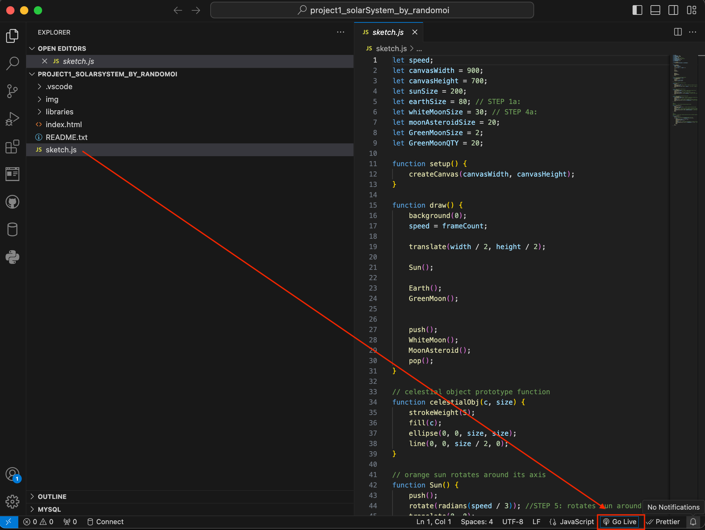
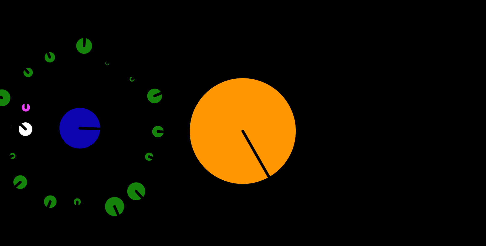
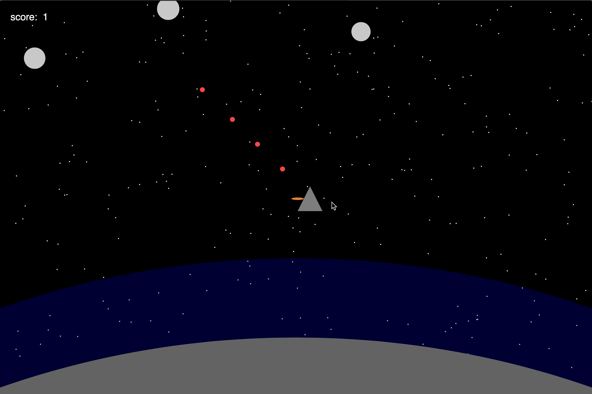
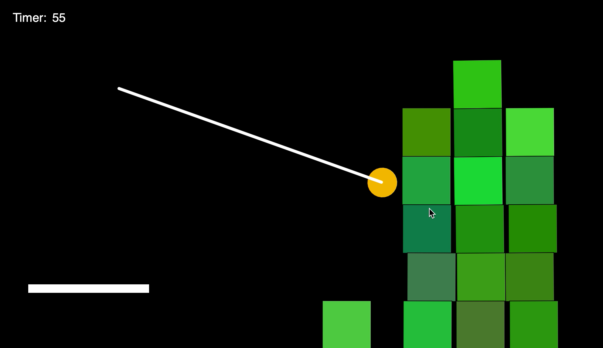
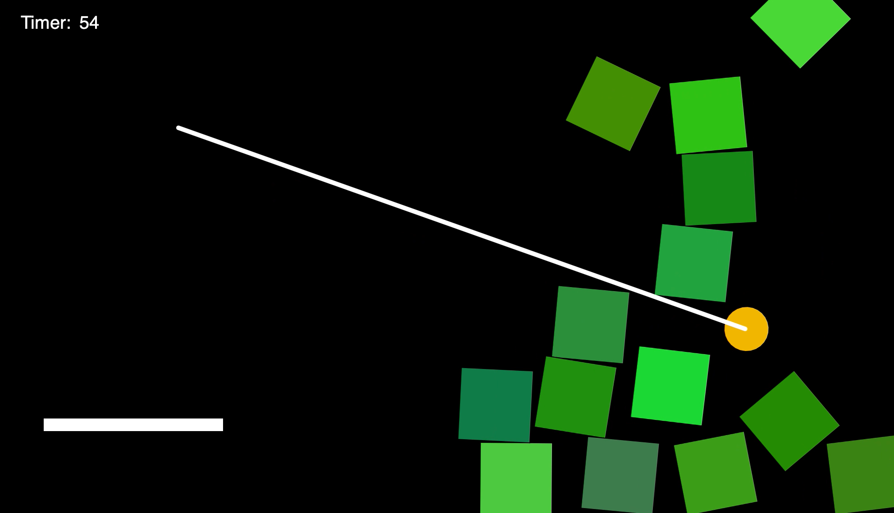
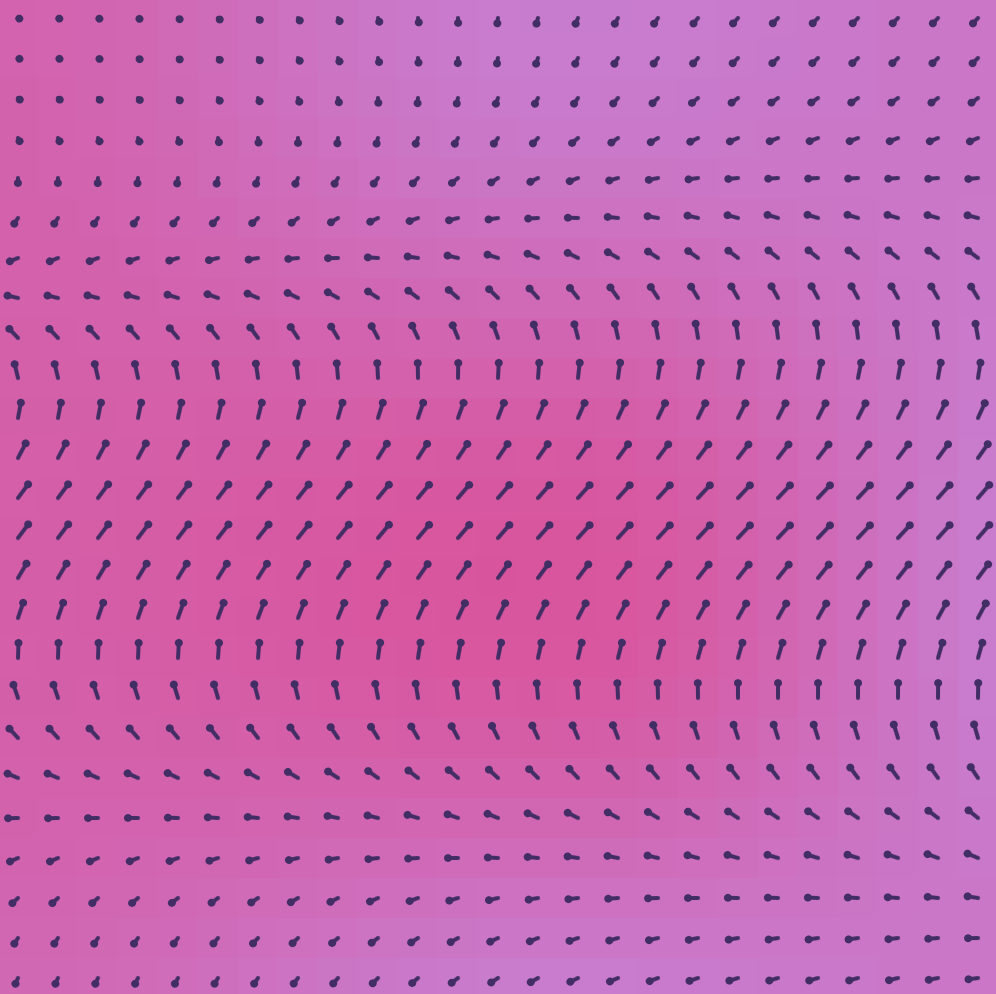
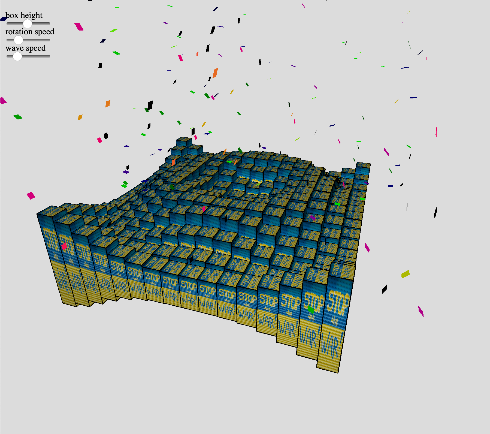
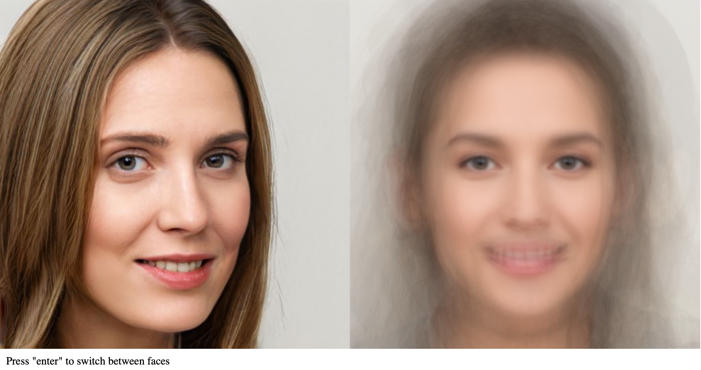
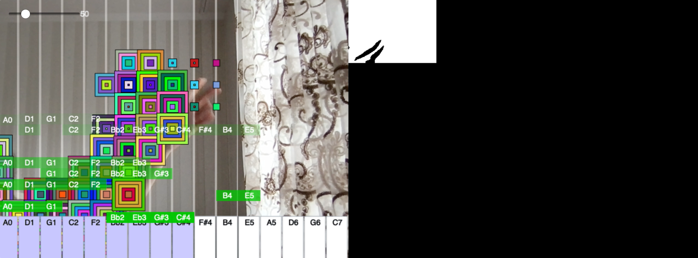

# PROJECT: Graphics Programming Mini Projects

Student: https://github.com/randomoi
***

## TABLE OF CONTENTS
1. [HOW TO USE](#HOWTOUSE)
2. [EXAMPLES](#EXAMPLES)

### HOW TO USE 
- In VS Code, please select sketch.js and press on  "Go Live" to view projects

### EXAMPLES 
**Project 1: Solar System** 

**Project 2: Asteroid Game** 

**Project 3: Angry Birds** 

**Project 4: Noisy Grid** 

**Project 5: 3DSine Game** 

**Project 6: Average Face** 

**Project 7: Instagram Filter** 

**Project 8: Webcam Piano** 

